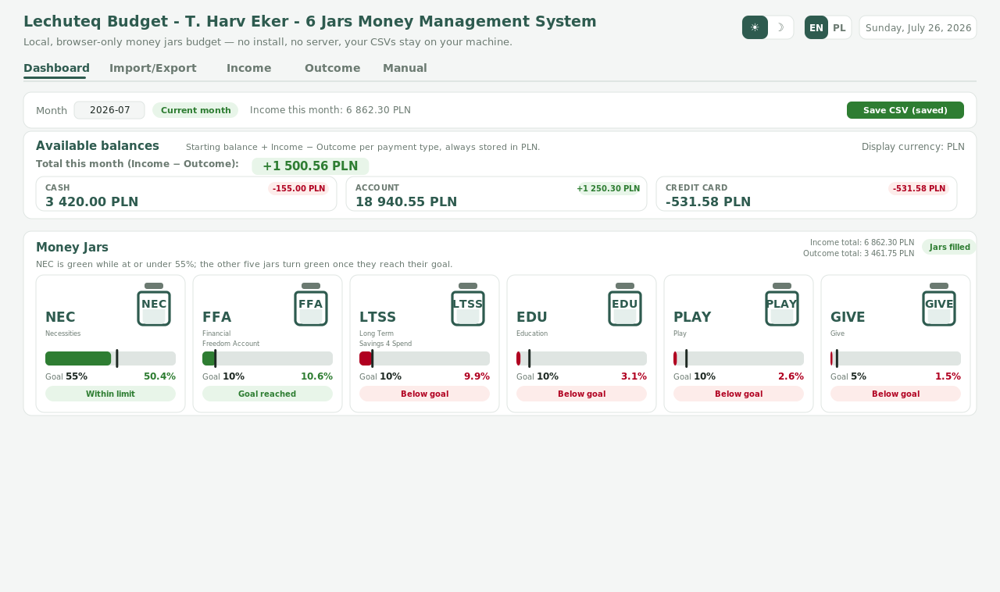

# Lechuteq Budget

**T. Harv Eker's 6 Jars money management system — as a single, local, browser-only HTML app.**

No install. No account. No server. No build step. Open the HTML file in any browser and it just works — your data lives in the browser tab and in the CSV files you download, and nowhere else.

Repository: [github.com/Lechuteq/budget6jars](https://github.com/Lechuteq/budget6jars)

## Why

Most budgeting apps want an account, a subscription, and your bank credentials. Lechuteq Budget is the opposite: a single self-contained `.html` file you can drop anywhere — a USB stick, a synced folder, a GitHub Gist — and run offline. It's built around the [6 Jars method](#background-the-6-jars-method), a percentage-based system for allocating income the moment it arrives instead of figuring out where it went at the end of the month.

## Features

- **Money Jars dashboard** — six jars (Necessities, Financial Freedom Account, Long Term Savings 4 Spend, Education, Play, Give) with hardcoded goal percentages and a live current percentage computed from your data, color-coded green/red so you can see at a glance where you stand, each with a small jar icon labeled by its shortcut. The section header shows neutral income/outcome totals for the month plus a jar-completeness indicator that stays red until every expense of the month has a jar assigned.
- **mBank paste-and-import** — copy transaction history straight from mBank's web view, paste it into the app, and it parses descriptions, categories, dates, and amounts automatically, routing rows to Income or Outcome by sign. Both mBank paste formats are recognized: the expanded detail view ("Kategoria:"/"Kwota:" blocks) and the compact transaction list (date / description / amount rows).
- **Available balances** — Cash, Account, and Credit Card balances computed from an editable starting balance plus your transaction history, with monthly net-change badges. To pay off a credit card (or move money between wallets generally), add an Outcome row with type `internal`: it moves real money — Account balance decreases, Credit Card balance is credited — while staying out of your Income/Outcome totals and jar tracking, since it's not real spending.
- **Historical / current / prediction indicator** — the month picker tells you whether you're looking at a closed past month, the month you're actively tracking, or a future month you're forecasting. If the month you're viewing doesn't match the month of the CSV data you last imported, a clear mismatch warning appears so you're never confused about what you're looking at.
- **Input validation** — Outcome amounts must be negative; new rows come pre-filled with a `-` sign and any positive outcome value is flagged in red until corrected.
- **Sortable tables** — click any Date, Value, Type, Income type, or Jar column header on the Income/Outcome tabs to sort by it; click again to reverse the order.
- **Save CSV button** — next to the Month picker, turns red the moment you edit, add, delete, or import a row, and saves both of the month's CSVs when clicked (with a native "Save As" folder picker on Chrome/Edge); turns green again once saved.
- **CSV-based storage** — two files per month (`YYYYMM_income.csv`, `YYYYMM_outcome.csv`), plain text, readable in Excel, Google Sheets, or any spreadsheet tool. Opening balances travel with the file so reloading an old month restores its starting point automatically.
- **Dark mode & English/Polish** — full UI translation, not just labels; both preferences persist across sessions.
- **Multi-currency label** — switch the symbol shown next to amounts between PLN, EUR, or USD; this only relabels the numbers, it never converts or recalculates them — every figure is always the same underlying PLN value.

## Getting started

1. Download `lechuteq_budget.html` (or clone this repo) and open it in any modern browser — Chrome, Firefox, Edge, Safari.
2. Optionally load the sample CSVs in `/samples` (see below) to explore the app with realistic data before using your own.
3. Go to the **Import/Export** tab, paste transaction text copied from mBank's web view, and click **Import pasted text**.
4. Review the payment `type` (imported rows default to `account`; switch the exceptions to `credit_card` / `cash`) and the `jar` (imported expenses default to `NEC`; reassign the ones that belong elsewhere) — the dashboard's jar-completeness indicator stays red if any expense of the month lacks a jar.
5. Click **Save CSV** (next to the Month picker) to save your work — it's red while you have unsaved changes and turns green once saved. Reload the same files next time via the file pickers on the Import/Export tab.

Full instructions, in English and Polish, are built into the app's **Manual** tab.

## Sample data

The `/samples` folder contains three months of realistic example data, built around the [Polish GUS average monthly salary for 2026](https://stat.gov.pl) (~9,400 PLN gross / ~6,800 PLN net) so the numbers feel true to life rather than arbitrary:

| File | Month | Status |
|---|---|---|
| `202606_income.csv` / `202606_outcome.csv` | June 2026 | Historical |
| `202607_income.csv` / `202607_outcome.csv` | July 2026 | Current |
| `202608_income.csv` / `202608_outcome.csv` | August 2026 | Prediction |

Load a pair into the Import/Export tab and switch the Dashboard's month picker to see the historical/current/prediction badge and jar percentages update.

## Data model

**Income** (`date, description, bank_category, value, type, income_type`)
**Outcome** (`date, description, bank_category, value, type, jar`)

`type` is one of `account` / `credit_card` / `cash` / `internal` (a technical type for wallet-to-wallet transfers such as a credit card payoff — see below). `income_type` is one of `salary` / `selling` / `additional` / `returns` / `passive` / `other`. `jar` is one of `NEC` / `FFA` / `LTSS` / `EDU` / `PLAY` / `GIVE`, or the technical `int_jar` (auto-assigned to `internal`-type Outcome rows). The `bank_category` field is shown in the UI as **Additional info** — the importer puts any detected bank category there, and beyond that it's a free-text notes field.

An `internal`-type Outcome row (e.g. `-500`) always represents money moving from your Account to your Credit card: the Account balance decreases by that amount and the Credit card balance is credited by the same amount, but the row is excluded from Income/Outcome totals and jar tracking since it isn't real spending.

## Background: the 6 Jars method

The 6 Jars system was popularized by **T. Harv Eker** in his 2005 book *Secrets of the Millionaire Mind: Mastering the Inner Game of Wealth*. The idea: split every unit of income across six jars by fixed percentage the moment it arrives — Necessities 55%, Financial Freedom Account 10%, Long-Term Savings for Spending 10%, Education 10%, Play 10%, Give 5% — so spending, investing, and giving happen automatically and proportionally instead of by accident. This app keeps that structure but replaces physical jars/envelopes with a CSV ledger you can reconcile against real bank statements.

## Tech

Vanilla HTML/CSS/JavaScript, one dependency loaded from a CDN ([PapaParse](https://www.papaparse.com/) for CSV parsing). No framework, no build step, no bundler. Everything — the mBank text parser, the balance math, the jar percentage logic — lives in a single `<script>` tag you can read top to bottom.

## License

MIT — see [LICENSE](LICENSE).

## Disclaimer

This is a personal finance tool built for personal use. It does not connect to your bank, does not move money, and does not transmit data anywhere. Always verify totals against your actual bank statements.

## Found an issue?

Repository: [github.com/Lechuteq/budget6jars](https://github.com/Lechuteq/budget6jars). If you run into a bug or have an idea for an improvement, please open an issue there so it can be tracked and fixed.
